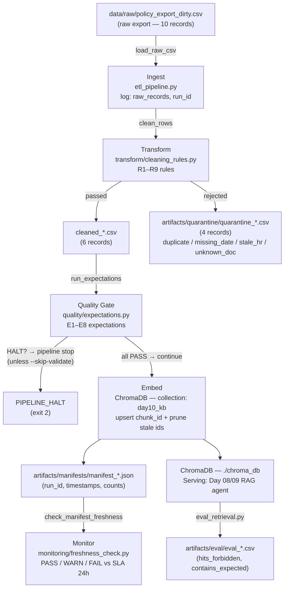

# Kiến trúc pipeline — Lab Day 10

**Nhóm:** Nhóm 6  
**Cập nhật:** 15/04/2026

---

## 1. Sơ đồ luồng



**Luồng chữ tóm tắt:**

```
policy_export_dirty.csv
  → [Ingest] load + log raw_records / run_id
  → [Transform] clean_rows (R1–R9): normalize date, dedupe, allowlist, HR version, refund fix, BOM strip, min length, exported_at check
      ├─ rejected → quarantine_*.csv
      └─ cleaned → cleaned_*.csv (6 records)
  → [Quality] run_expectations (E1–E8): halt nếu vi phạm nghiêm trọng
  → [Embed] upsert chunk_id vào ChromaDB / prune id cũ
  → [Manifest] ghi manifest_*.json (run_id, counts, latest_exported_at)
  → [Monitor] freshness_check: so sánh latest_exported_at với SLA 24h → PASS/FAIL
  → [Eval] eval_retrieval.py: kiểm tra top-k retrieval → eval_*.csv
```

**Điểm đo freshness:** sau bước Embed, manifest ghi `latest_exported_at` = max `exported_at` trong cleaned rows → `freshness_check.py` đọc và so sánh với `datetime.now(UTC)`.

**Chỗ ghi `run_id`:** `etl_pipeline.py` sinh `run_id` từ tham số `--run-id` hoặc UTC timestamp; ghi vào log, manifest, và metadata từng chunk trong ChromaDB.

**File quarantine:** `artifacts/quarantine/quarantine_{run_id}.csv` — ghi kèm cột `reason` và `effective_date_normalized` cho mỗi chunk bị cách ly.

---

## 2. Ranh giới trách nhiệm

| Thành phần | File chính | Input | Output | Owner nhóm |
|------------|-----------|-------|--------|------------|
| **Ingest** | `etl_pipeline.py` → `cmd_run` | `data/raw/policy_export_dirty.csv` | rows thô (list[dict]), log `raw_records` | Ingestion Owner |
| **Transform** | `transform/cleaning_rules.py` | rows thô (10 records) | `cleaned_*.csv` (6 records) + `quarantine_*.csv` (4 records) | Cleaning / Quality Owner |
| **Quality** | `quality/expectations.py` | cleaned rows | `(results, halt: bool)` — log từng expectation PASS/FAIL | Cleaning / Quality Owner |
| **Embed** | `etl_pipeline.py` → `cmd_embed_internal` | `cleaned_*.csv`, ChromaDB collection | ChromaDB upsert + prune, log `embed_upsert count` | Embed Owner |
| **Monitor** | `monitoring/freshness_check.py` | `manifest_*.json` | `("PASS"\|"WARN"\|"FAIL", detail dict)` — log `freshness_check` | Monitoring / Docs Owner |
| **Eval** | `eval_retrieval.py` | `data/test_questions.json`, ChromaDB | `artifacts/eval/eval_*.csv` (`hits_forbidden`, `contains_expected`) | Embed Owner |

---

## 3. Idempotency & rerun

**Strategy:** upsert theo `chunk_id` + prune id thừa sau mỗi publish.

```python
# etl_pipeline.py — cmd_embed_internal
col.upsert(ids=ids, documents=documents, metadatas=metadatas)  # idempotent

# Prune: xóa chunk_id không còn trong cleaned run hiện tại
prev_ids = set(col.get(include=[]).get("ids") or [])
drop = sorted(prev_ids - set(ids))
if drop:
    col.delete(ids=drop)
```

**`chunk_id` được sinh ổn định** bởi `_stable_chunk_id(doc_id, chunk_text, seq)` = `{doc_id}_{seq}_{sha256[:16]}` — cùng nội dung luôn cho cùng ID.

**Rerun 2 lần có duplicate không?** Không — `col.upsert` ghi đè nếu `chunk_id` đã tồn tại; prune loại bỏ id cũ không còn trong cleaned. Sau 2 lần rerun với cùng input, số vector trong collection giữ nguyên. Đây là "index = snapshot publish" — mỗi run tạo ra trạng thái nhất quán.

**Lưu ý:** `run_id` được ghi vào metadata của mỗi chunk, cho phép truy vết từng vector về đúng run sinh ra nó.

---

## 4. Liên hệ Day 09

Pipeline Day 10 và Day 09 **dùng chung corpus tài liệu** (`data/docs/`):

| Tài liệu | `doc_id` | Dùng ở Day 09 | Dùng ở Day 10 |
|----------|---------|--------------|--------------|
| `policy_refund_v4.txt` | `policy_refund_v4` | RAG agent trả lời chính sách hoàn tiền | Cleaning rule R6 fix "14 ngày → 7 ngày"; Expectation E3 |
| `sla_p1_2026.txt` | `sla_p1_2026` | RAG agent trả lời SLA ticket P1 | Pass thẳng qua pipeline (clean) |
| `it_helpdesk_faq.txt` | `it_helpdesk_faq` | RAG agent trả lời FAQ helpdesk | Rule R2 normalize `effective_date` (01/02/2026 → 2026-02-01) |
| `hr_leave_policy.txt` | `hr_leave_policy` | RAG agent trả lời chính sách nghỉ phép | Rule R3 quarantine bản HR 2025; Expectation E6 |
| `access_control_sop.txt` | *(chưa export)* | Tham khảo | Không có trong raw CSV mẫu |

**Kết nối kỹ thuật:**
- Day 10 embed vào **cùng ChromaDB** (`./chroma_db`, collection `day10_kb`) mà Day 09 agent đọc.
- Sau mỗi pipeline run, agent Day 09 tự động nhận corpus mới (không cần restart) nhờ `PersistentClient`.
- Khi pipeline inject dữ liệu xấu (`inject-bad`), agent Day 09 sẽ trả lời sai ("14 ngày") — đây là bằng chứng quan sát được (`eval_bad.csv: hits_forbidden=yes`).
- Khi pipeline chạy chuẩn (`sprint4-final`), agent trả lời đúng (`eval_clean.csv: hits_forbidden=no`).

---

## 5. Rủi ro đã biết

- **`--skip-validate` bypass expectation halt:** Flag này cho phép chunk sai lọt vào embed ngay cả khi expectation E3 (halt) báo FAIL — chỉ dùng cho demo có chủ đích Sprint 3; phải bị chặn trên CI/CD production.
- **Freshness SLA luôn FAIL trong lab:** `latest_exported_at = 2026-04-10T08:00:00` cách thời điểm chạy ~120 giờ, vượt SLA 24h. Môi trường thật cần cronjob re-export thường xuyên.
- **Prune vector thủ công chưa hoàn hảo:** Nếu ChromaDB restart hoặc collection bị tạo lại, prune có thể ném exception và bị `try/except` bỏ qua (`log WARN: embed prune skip`) — vector cũ có thể sót lại.
- **`owner_team` và `alert_channel` chưa điền** trong `contracts/data_contract.yaml` — không có người chịu trách nhiệm khi freshness FAIL.
- **Eval chỉ dùng keyword matching:** `eval_retrieval.py` kiểm tra `must_contain_any` / `must_not_contain` trên top-k chunk ghép lại — chưa đánh giá được chất lượng câu trả lời cuối (LLM output) của agent.
- **Không có schema migration:** Khi thêm `doc_id` mới, phải cập nhật đồng thời `ALLOWED_DOC_IDS` (cleaning_rules.py), `allowed_doc_ids` (data_contract.yaml), và test questions — dễ bỏ sót một trong ba nơi.
